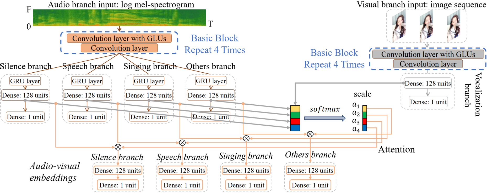
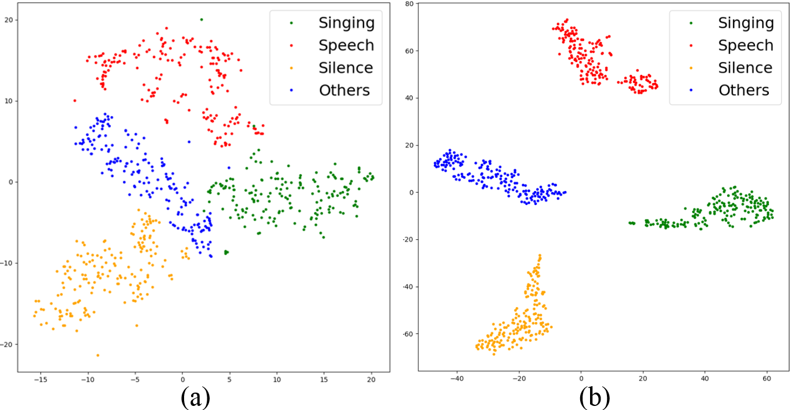
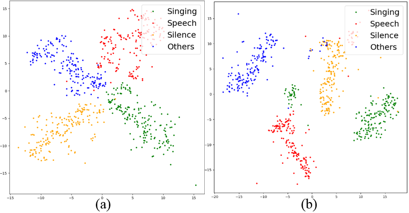
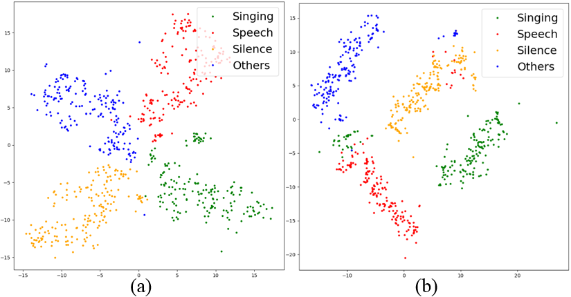
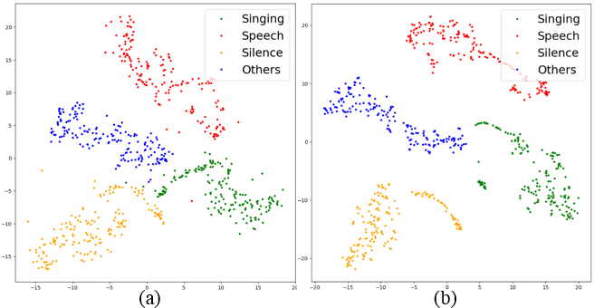
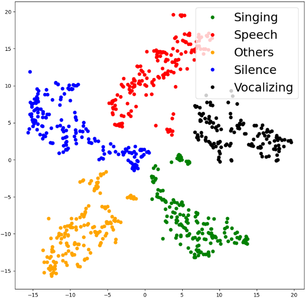
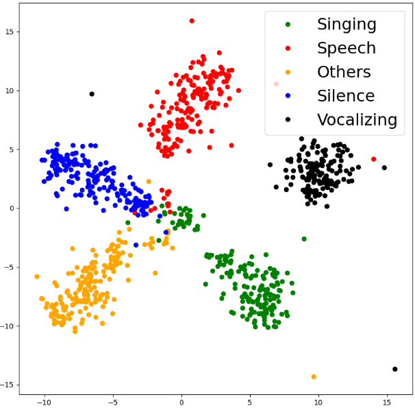
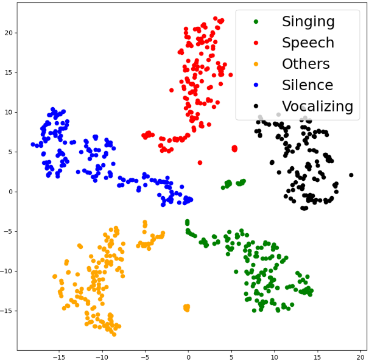
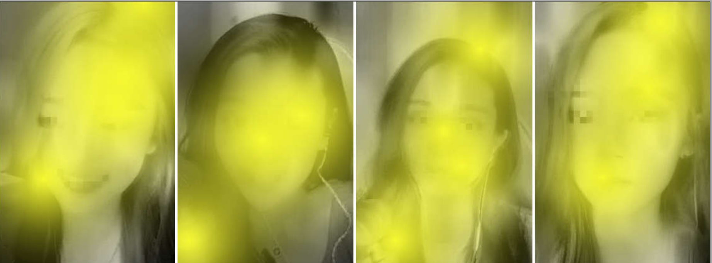

Supplementary materials for the paper: Attention-based cross-modal fusion for audio-visual voice activity detection in musical video streams

<h3 align="left"><a name="part3">For real video detection demos, please see <a href="https://yuanbo2021.github.io/Attention-based-AV-VAD/" 
target="https://yuanbo2021.github.io/Attention-based-audio-visual-VAD/">here</a>.

</h3> 

<h3 align="left"><a name="part3">1. The proposed attention-based AVVAD (ATT-AVVAD) framework.</a>

</h3> 

 The proposed attention-based AVVAD (ATT-AVVAD) framework consists of the audio-based module (audio branch), image-based module (visual branch), and attention-based fusion module. The audio-based module produces acoustic representation vectors for four target audio events: Silence, Speech of the anchor, Singing voice of the anchor, and Others. The image-based module aims to obtain the possibility of anchor vocalization based on facial parameters. Finally, we propose an attention-based module to fuse audio-visual information to comprehensively consider the bi-modal information to make final decisions at the audio-visual level.

<h3 align="left">2. Visualization of core representation vectors distribution after attention-based fusion from a test sample using t-SNE.

</h3> 

 The vectors in subgraph (a) are from the audio branch, vectors in subgraph (b) are from audio-visual modules after attention-based fusion.

 
<h3> Sample 1 </h3> 
 

<h3> Sample 2 </h3> 
 

<h3> Sample 3 </h3> 
 

<h3> Sample 4 </h3> 

<h3 align="left">3. Visualization of acoustic representation vectors and visual vocalization vector distribution from a test sample using t-SNE.

</h3> 

 The vector (black dots) representing the vocalizing of the anchor is distributed on the side representing the voices of the anchor (green dots for singing, red dots for speech).

<h3> Sample 5 </h3> 

 

<h3> Sample 6 </h3> 

 

<h3> Sample 7 </h3> 

<h3 align="left">4. What information will the visual branch mainly focus on?

</h3>

<h3> Figure 8: The highlighted areas represent the focus of the model. </h3> 

To intuitively inspect the focal areas of the model, a visualization method CAM for deep networks is used in this paper. As shown in Figure 8, the visual branch mainly focuses on the eye and lip contours of the anchor, and the high-level representation of facial parameters is used to judge whether the anchor is vocalizing. This proves that the visual branch designed in this paper performs as expected.

In the proposed ATT-AVVAD framework, the audio branch roughly distinguishes the target sound events in latent space, but it is not accurate enough. The visual branch predicts the probability of the anchor vocalizing from the facial information in the image sequence, so as to correct the learned representations from the audio branch, and then transmit them to the classification layer of the audio-visual module for final decisions. The above results show that each branch has achieved the expected goal, and the fusion based on semantic similarity is reasonable and effective.

<h3 align="left">5. For the source code, please check the Code.

</h3>

If you want to watch more intuitively, please see here: https://yuanbo2021.github.io/Attention-based-AV-VAD/.

